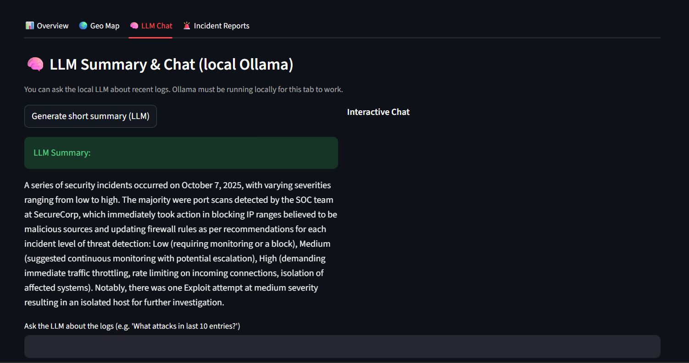
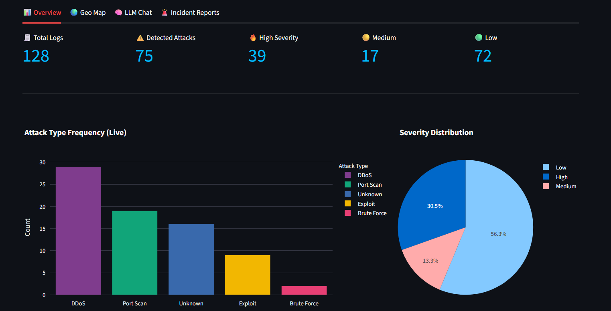
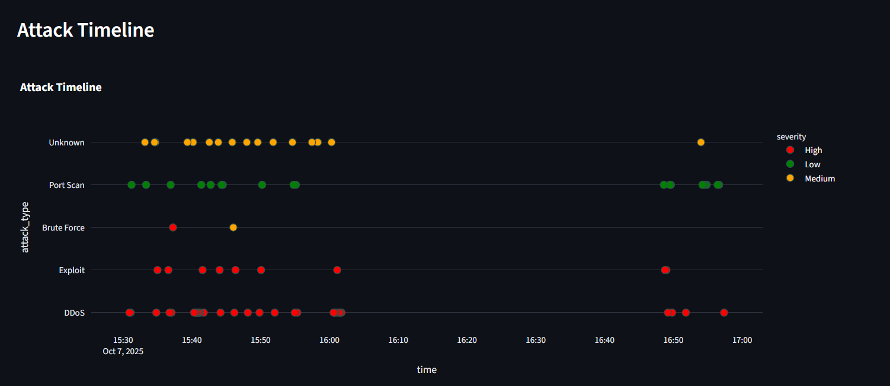
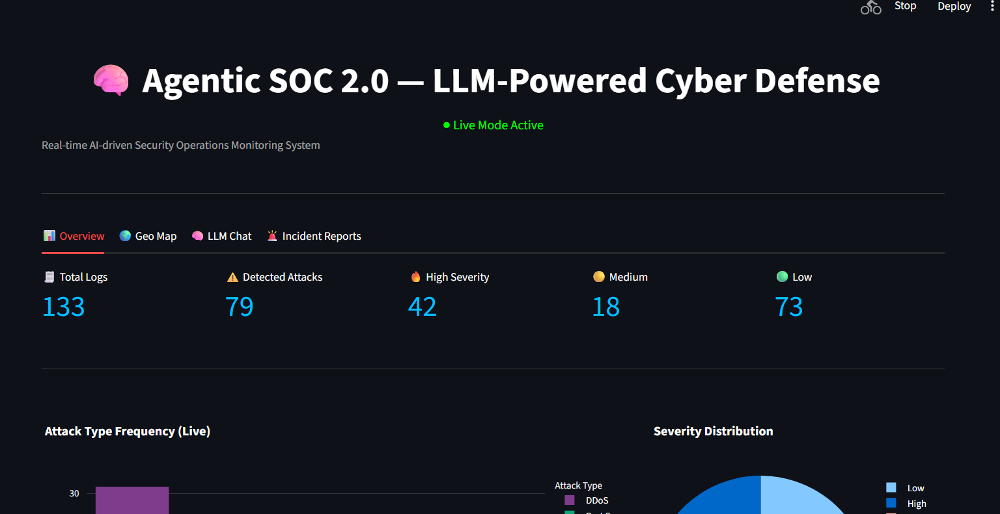

# 🧠 Agentic SOC 2.0 — LLM-Powered Cyber Defense

[](https://www.python.org/)
[](https://www.crewai.com/)
[](https://streamlit.io/)
[](LICENSE)

> **An intelligent, multi-agent Security Operations Center (SOC) that leverages Large Language Models (LLMs) for real-time cyber threat detection, reasoning, and automated response.**

## 📋 Table of Contents

- [Overview](#overview)
- [Architecture](#architecture)
- [Key Features](#key-features)
- [Technology Stack](#technology-stack)
- [System Components](#system-components)
- [Prerequisites](#prerequisites)
- [Installation](#installation)
- [Usage](#usage)
- [Project Structure](#project-structure)
- [Dataset Information](#dataset-information)
- [Model Training](#model-training)
- [Dashboard Features](#dashboard-features)
- [Configuration](#configuration)
- [Troubleshooting](#troubleshooting)
- [Contributing](#contributing)
- [License](#license)

---

## 🎯 Overview

**Agentic SOC 2.0** is an advanced, AI-powered Security Operations Center that combines machine learning models with Large Language Model (LLM) reasoning to provide comprehensive cybersecurity threat detection and response capabilities. The system operates in real-time, analyzing network traffic logs, identifying potential attacks, classifying threat severity, and automatically executing defensive actions.

### What Makes It Special?

- **Multi-Agent Architecture**: Three specialized AI agents work collaboratively to detect, reason about, and respond to cyber threats
- **LLM-Powered Reasoning**: Uses local LLM (Phi-3 via Ollama) for intelligent threat analysis and classification
- **Real-Time Monitoring**: Continuous network log streaming and analysis with live dashboard visualization
- **Automated Response**: Intelligent defensive actions based on attack type and severity
- **Production-Ready**: Built with modern frameworks like CrewAI, scikit-learn, and Streamlit

---

## 🏗️ Architecture

The Agentic SOC system follows a three-stage pipeline architecture:

```
Network Logs → Detection Agent → Reasoning Agent → Response Agent → Actions
                     ↓                  ↓                  ↓
                  ML Model         LLM Analysis    Automated Defense
```

### High-Level Workflow

1. **Log Ingestion**: Network logs are continuously streamed from the UNSW-NB15 dataset
2. **Detection**: Machine Learning model (Random Forest) classifies logs as "Attack" or "Benign"
3. **Reasoning**: LLM analyzes detected attacks to determine type, severity, and recommendations
4. **Response**: Automated defensive actions are triggered based on threat classification
5. **Visualization**: Real-time dashboard displays metrics, charts, and incident reports



---

## ✨ Key Features

### 🔍 Intelligent Detection
- ML-powered anomaly detection using Random Forest classifier
- 19-feature network traffic analysis
- High accuracy with optimized hyperparameters (120 estimators, max_depth=20)

### 🧠 LLM-Based Reasoning
- Local Phi-3 model integration via Ollama
- Contextual threat analysis with structured JSON responses
- Rule-based refinement for improved accuracy
- Attack classification: DDoS, Port Scan, Brute Force, Exploit, Data Exfiltration

### ⚡ Automated Response
- Immediate defensive actions based on attack type:
  - **DDoS**: Throttle network traffic
  - **Port Scan**: Block IP range
  - **Brute Force**: Lock account
  - **Exploit**: Isolate host
  - **Data Exfiltration**: Terminate outbound connections

### 📊 Real-Time Dashboard
- Live metrics and KPIs
- Attack type frequency visualization
- Severity distribution charts
- Recent incidents table with color-coded severity
- Auto-refresh capabilities

### 🎨 Additional Features
- Unified launcher script for easy deployment
- Color-coded console output for better visibility
- JSON-based action logging
- Extensible agent architecture

---

## 🛠️ Technology Stack

### Core Frameworks
- **[CrewAI](https://www.crewai.com/)** (0.201.1) - Multi-agent orchestration framework
- **[Ollama](https://ollama.ai/)** - Local LLM hosting and inference
- **[scikit-learn](https://scikit-learn.org/)** (1.7.2) - Machine learning and model training
- **[Streamlit](https://streamlit.io/)** (1.50.0) - Interactive web dashboard

### Data & Processing
- **pandas** (2.3.3) - Data manipulation and analysis
- **NumPy** (2.3.3) - Numerical computing
- **joblib** (1.5.2) - Model serialization

### Visualization
- **Plotly** (via plotly.express) - Interactive charts and graphs
- **Altair** (5.5.0) - Declarative statistical visualization

### Other Technologies
- **Python 3.8+** - Core programming language
- **JSON** - Data interchange format
- **Threading** - Concurrent process execution

---

## 🤖 System Components

### 1. Detection Agent

**Role**: Analyzes incoming log events and detects suspicious activity

**Responsibilities**:
- Load pre-trained Random Forest model (`models/detector.pkl`)
- Process network log features (19 dimensions)
- Classify logs as "Attack" or "Benign"
- Handle model compatibility and missing features gracefully

**Key Methods**:
```python
def run(self, log_data: dict) -> dict:
    # Returns: {"status": "Attack"} or {"status": "Benign"}
```

**Features Analyzed**:
- Duration (`dur`), source/destination packets (`spkts`, `dpkts`)
- Bytes transferred (`sbytes`, `dbytes`)
- Time-to-live values (`sttl`, `dttl`)
- Network load (`sload`, `dload`)
- Inter-packet times (`sinpkt`, `dinpkt`)
- Jitter values (`sjit`, `djit`)
- Connection metrics (`ct_srv_src`, `ct_srv_dst`, `ct_dst_sport_ltm`)

### 2. Reasoning Agent

**Role**: LLM-based security analyst for threat classification

**Responsibilities**:
- Query local Phi-3 model via Ollama
- Analyze detection results with contextual understanding
- Apply heuristic rules for refinement
- Generate structured threat intelligence

**Key Methods**:
```python
def run(self, detection_result: dict) -> dict:
    # Returns: {
    #   "attack_type": "DDoS|Port Scan|Brute Force|Exploit|Data Exfiltration|Unknown",
    #   "severity": "Low|Medium|High",
    #   "recommendation": "Actionable mitigation advice"
    # }
```

**Attack Classification Logic**:
- **Port Scan**: Very short duration (<0.01s) with minimal packets
- **DDoS**: High packet volume (>1000 spkts) in short time (<2s)
- **Brute Force**: Moderate packets (>50 spkts) in <0.5s
- **Data Exfiltration**: Long duration (>20s) with few destination packets
- **Exploit**: Long duration (>5s) with high packet count

### 3. Response Agent

**Role**: Automated defender executing protective measures

**Responsibilities**:
- Map attack types to appropriate defensive actions
- Log all incidents with timestamps
- Provide actionable feedback to operators

**Key Methods**:
```python
def run(self, reasoning_result: dict) -> dict:
    # Returns: {"action": "Defensive action taken"}
```

**Action Mapping**:
| Attack Type | Automated Response |
|------------|-------------------|
| DDoS | Throttled network traffic |
| Port Scan | Blocked IP range |
| Brute Force | Locked account |
| Exploit | Isolated host |
| Data Exfiltration | Terminated outbound connections |
| Unknown | Logged incident |

---

## 📋 Prerequisites

### System Requirements
- **Operating System**: Linux, macOS, or Windows 10/11
- **Python**: Version 3.8 or higher
- **RAM**: Minimum 8GB (16GB recommended for LLM inference)
- **Disk Space**: ~5GB free (for dependencies and models)

### Required Software
1. **Python 3.8+** - [Download](https://www.python.org/downloads/)
2. **Ollama** - [Installation Guide](https://ollama.ai/download)
3. **Git** (for cloning repository)

### Ollama Setup
After installing Ollama, pull the Phi-3 model:
```bash
ollama pull phi3
```

Verify installation:
```bash
ollama list
# Should show phi3 in the list
```

---

## 📦 Installation

### Step 1: Clone the Repository
```bash
git clone https://github.com/AnirudhDattu/Agentic-SOC.git
cd Agentic-SOC
```

### Step 2: Install Python Dependencies
```bash
pip install -r requirements.txt
```

**Note**: The `requirements.txt` includes all necessary packages including:
- `crewai`, `ollama`, `streamlit`
- `scikit-learn`, `pandas`, `numpy`
- `plotly`, visualization libraries

### Step 3: Verify Dataset
Ensure the dataset exists:
```bash
ls data/network_logs.csv
```

If missing, the UNSW-NB15 dataset should be placed in the `data/` directory.

### Step 4: Train the Detection Model (Optional)
If `models/detector.pkl` doesn't exist, train the model:
```bash
python models/train_model.py
```

Expected output:
```
✅ Model trained and saved with 19 features.
```

### Step 5: Test the Model (Optional)
```bash
python models/test_model.py
```

---

## 🚀 Usage

### Quick Start - Unified Launcher

The easiest way to start the entire system:

```bash
python start_soc.py
```

This single command launches:
1. **Log Streamer** - Simulates network traffic
2. **Main SOC Pipeline** - Runs all three agents
3. **Dashboard** - Web interface at `http://localhost:8501`

**Console Output**:
```
=== 🚀 Launching Agentic SOC 2.0 ===

[Launcher] Starting Log Streamer ...
[Launcher] Starting Main SOC Pipeline ...
[Launcher] Starting Dashboard ...

[Launcher] All components started.
→ Log Streamer, Main SOC, and Dashboard running.
Visit: http://localhost:8501

Press Ctrl+C to stop everything.
```

### Manual Start (Component-by-Component)

If you prefer to run components separately:

#### Terminal 1: Start Log Streamer
```bash
python infra/log_streamer.py
```
Streams one log every 2 seconds from the dataset.

#### Terminal 2: Run Main SOC Pipeline
```bash
python main.py
```
Executes the three-agent pipeline continuously.

**Expected Output**:
```bash
=== 🚀 Agentic SOC 2.0 Live Mode Started ===

[DetectionAgent] ✅ Model loaded successfully.
───────────────────────────────────────────────
[ Event Detected ]
→  Status: Attack
→  Attack Type: DDoS
→  Severity: High
→  Recommendation: Enable rate limiting and block suspicious IPs.
→  Action Taken: Throttled network traffic
───────────────────────────────────────────────
```

#### Terminal 3: Launch Dashboard
```bash
streamlit run app/dashboard2.py
```
Access the dashboard at `http://localhost:8501`

---

## 📁 Project Structure

```
Agentic-SOC/
├── agents/                          # AI Agent implementations
│   ├── detection_agent.py          # ML-based threat detector
│   ├── reasoning_agent.py          # LLM-powered analyst
│   └── response_agent.py           # Automated defender
│
├── app/                             # Web dashboard
│   ├── dashboard.py                # Basic dashboard
│   └── dashboard2.py               # Enhanced dashboard with tabs
│
├── data/                            # Datasets
│   ├── network_logs.csv            # UNSW-NB15 (preprocessed)
│   └── UNSW_NB15_testing-set.csv   # Original test set
│
├── infra/                           # Infrastructure utilities
│   ├── log_streamer.py             # Network log simulator
│   ├── clean_logs.py               # Action log maintenance
│   ├── action_log.json             # Incident records
│   └── live_log.json               # Current log being processed
│
├── models/                          # ML models and training
│   ├── detector.pkl                # Trained Random Forest model
│   ├── train_model.py              # Model training script
│   └── test_model.py               # Model evaluation script
│
├── Images/                          # Documentation assets
│   ├── Dashboard1.png
│   ├── Dashboard2.png
│   ├── Dashboard3.png
│   └── LLMimg.png
│
├── main.py                          # Main SOC pipeline
├── start_soc.py                     # Unified launcher
├── requirements.txt                 # Python dependencies
├── README.md                        # This file
├── LICENSE                          # License information
└── .gitignore                       # Git ignore rules
```

---

## 📊 Dataset Information

### UNSW-NB15 Dataset

The system uses the **UNSW-NB15** dataset, a comprehensive network intrusion detection dataset created by the Australian Centre for Cyber Security (ACCS).

**Key Characteristics**:
- **Records**: ~2.5 million network flows
- **Attack Categories**: 9 types (Fuzzers, Analysis, Backdoors, DoS, Exploits, Generic, Reconnaissance, Shellcode, Worms)
- **Features**: 49 attributes including flow, basic, content, time, and additional generated features
- **Labels**: Binary (0=Normal, 1=Attack)

**Feature Subset Used (19 features)**:
The system uses a carefully selected subset optimized for performance:
- Flow features: `dur`, `spkts`, `dpkts`, `sbytes`, `dbytes`
- Network layer: `sttl`, `dttl`, `swin`, `stcpb`, `dtcpb`
- Performance: `sload`, `dload`, `sinpkt`, `dinpkt`, `sjit`, `djit`
- Connection context: `ct_srv_src`, `ct_srv_dst`, `ct_dst_sport_ltm`

**Citation**:
```
Moustafa, N., & Slay, J. (2015). UNSW-NB15: a comprehensive data set for 
network intrusion detection systems. Military Communications and Information 
Systems Conference (MilCIS), 2015.
```

---

## 🎓 Model Training

### Training Process

The detection model uses a **Random Forest Classifier** with optimized hyperparameters:

```python
RandomForestClassifier(
    n_estimators=120,      # Number of trees
    max_depth=20,          # Maximum tree depth
    min_samples_split=3,   # Minimum samples for split
    random_state=42        # Reproducibility
)
```

### Training the Model

```bash
python models/train_model.py
```

**What Happens**:
1. Loads `data/network_logs.csv`
2. Extracts 19 features and labels
3. Splits data (80% train, 20% test)
4. Trains Random Forest classifier
5. Saves model to `models/detector.pkl`

### Model Evaluation

```bash
python models/test_model.py
```

**Expected Metrics**:
- **Accuracy**: ~95%+
- **Precision**: High for attack class
- **Recall**: Balanced for both classes
- **F1-Score**: Strong overall performance

### Retraining

To retrain with different parameters or updated data:
1. Modify hyperparameters in `models/train_model.py`
2. Update feature selection if needed
3. Run training script
4. Restart the SOC system

---

## 📈 Dashboard Features

### Overview Tab (📊)



**Metrics Displayed**:
- **Total Incidents**: Count of all logged events
- **Total Attacks**: Non-benign threats detected
- **High/Medium/Low Severity**: Incident breakdown
- **Attack Type Frequency**: Bar chart of attack distribution
- **Severity Distribution**: Pie chart of severity levels

**Performance Indicators**:
- Detection Agent runtime
- Reasoning Agent runtime
- Response Agent runtime

### Recent Incidents Table
- Real-time scrolling incident log
- Color-coded severity (🔴 High, 🟡 Medium, 🟢 Low)
- Timestamp, attack type, recommendation, and action columns

### Geo Map Tab (🌍)



*Simulated geographical visualization of attack sources*

### LLM Chat Tab (🧠)



- Interactive chat interface with the Phi-3 model
- Query historical incidents
- Ask for security recommendations
- Natural language threat analysis

### Incident Reports Tab (🚨)

- Detailed incident investigation
- Individual event analysis
- Historical data review

### Dashboard Controls

**Sidebar Options**:
- ✅ **Auto-refresh**: Toggle 2-second refresh
- 🔢 **Entries to show**: Slider (20-400)
- 🎯 **Filter by Attack Type**: Multi-select dropdown
- 🎯 **Filter by Severity**: Multi-select dropdown

---

## ⚙️ Configuration

### Ollama Model Configuration

Change the LLM model in `agents/reasoning_agent.py`:
```python
response = ollama.chat(
    model="phi3",  # Change to: llama2, mistral, etc.
    messages=[{"role": "user", "content": prompt}]
)
```

Available models (requires pulling via Ollama):
- `phi3` (default, lightweight)
- `llama2` (more powerful)
- `mistral` (fast inference)
- `codellama` (code-focused)

### Log Streaming Rate

Adjust in `infra/log_streamer.py`:
```python
time.sleep(2)  # Change to desired interval (seconds)
```

### Dashboard Refresh Rate

Modify in `app/dashboard2.py`:
```python
time.sleep(2)  # Change refresh interval
```

### Agent Behavior

Customize agent prompts and rules in respective files:
- `agents/detection_agent.py` - Model thresholds
- `agents/reasoning_agent.py` - LLM prompts, heuristics
- `agents/response_agent.py` - Action mappings

---

## 🔧 Troubleshooting

### Common Issues

#### 1. Ollama Connection Failed
**Error**: `Connection to Ollama failed`

**Solution**:
```bash
# Check if Ollama is running
ollama list

# Start Ollama service (if needed)
ollama serve

# Pull the model again
ollama pull phi3
```

#### 2. Model Not Found
**Error**: `[DetectionAgent] ⚠️ Model not found, using mock mode.`

**Solution**:
```bash
# Train the model
python models/train_model.py

# Verify model exists
ls models/detector.pkl
```

#### 3. Missing Dataset
**Error**: `FileNotFoundError: data/network_logs.csv`

**Solution**:
- Ensure the UNSW-NB15 dataset is placed in `data/` directory
- Download from [official source](https://research.unsw.edu.au/projects/unsw-nb15-dataset)
- Verify CSV file has correct column names

#### 4. Dashboard Not Loading
**Error**: Dashboard stuck on "Please wait..."

**Solution**:
```bash
# Ensure main.py and log_streamer.py are running
ps aux | grep python

# Check action_log.json exists
ls infra/action_log.json

# Clean logs if corrupted
python infra/clean_logs.py
```

#### 5. Import Errors
**Error**: `ModuleNotFoundError: No module named 'crewai'`

**Solution**:
```bash
# Reinstall dependencies
pip install -r requirements.txt --upgrade

# Verify installation
pip list | grep crewai
```

### Performance Optimization

**For Faster Inference**:
- Use a lighter LLM model (`phi3:mini`)
- Increase log streaming interval
- Reduce dashboard refresh rate
- Limit dashboard entries shown

**For Better Accuracy**:
- Retrain model with more estimators
- Fine-tune reasoning heuristics
- Collect more training data

---

## 🤝 Contributing

Contributions are welcome! Here's how you can help:

### Development Setup
1. Fork the repository
2. Create a feature branch: `git checkout -b feature/amazing-feature`
3. Make your changes
4. Test thoroughly
5. Commit: `git commit -m 'Add amazing feature'`
6. Push: `git push origin feature/amazing-feature`
7. Open a Pull Request

### Areas for Contribution
- 🎯 Additional attack type detection
- 🧠 Alternative LLM integrations
- 📊 Enhanced dashboard visualizations
- 🔒 New defensive action implementations
- 📚 Documentation improvements
- 🧪 Test coverage expansion

### Code Style
- Follow PEP 8 guidelines
- Add docstrings to new functions
- Include type hints where appropriate
- Write clear commit messages

---

## 📄 License

This project is licensed under the MIT License - see the [LICENSE](LICENSE) file for details.

---

## 🙏 Acknowledgments

- **UNSW-NB15 Dataset**: Australian Centre for Cyber Security (ACCS)
- **CrewAI**: Multi-agent orchestration framework
- **Ollama**: Local LLM hosting platform
- **Streamlit**: Dashboard framework
- **Open Source Community**: For amazing tools and libraries

---

## 📧 Contact & Support

- **GitHub Issues**: [Report bugs or request features](https://github.com/AnirudhDattu/Agentic-SOC/issues)
- **Discussions**: [Ask questions and share ideas](https://github.com/AnirudhDattu/Agentic-SOC/discussions)

---

## 🎯 Roadmap

**Upcoming Features**:
- [ ] Integration with SIEM platforms (Splunk, ELK)
- [ ] Real-time network packet capture
- [ ] Multi-model LLM ensemble reasoning
- [ ] Email/Slack alerting system
- [ ] Historical threat intelligence database
- [ ] Advanced forensics capabilities
- [ ] Kubernetes deployment support

---

<div align="center">

**Built with ❤️ by the Agentic SOC Team**

⭐ Star this repo if you find it useful! ⭐

</div>
